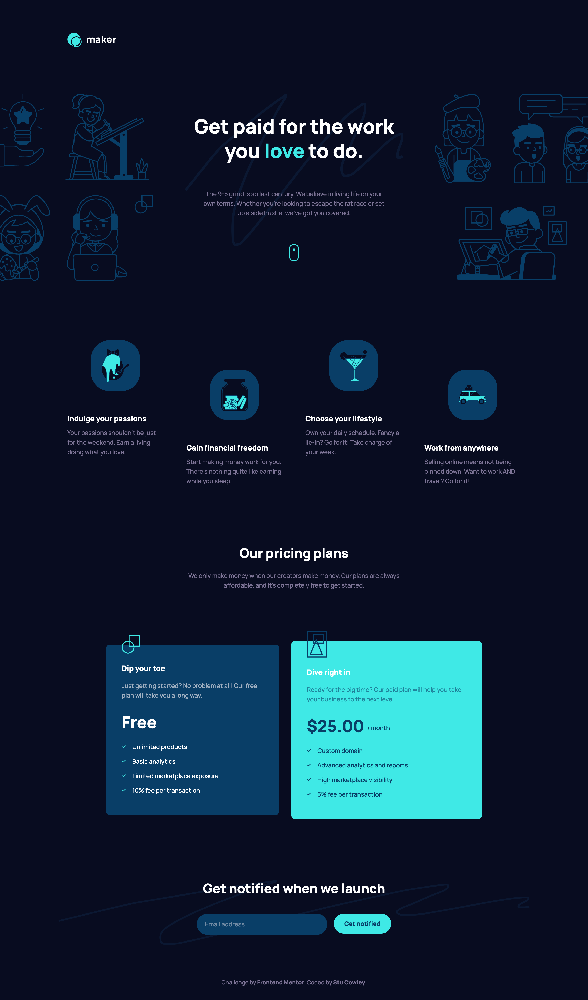

# Frontend Mentor - Maker pre-launch landing page solution

This is a solution to the [Maker pre-launch landing page challenge on Frontend Mentor](https://www.frontendmentor.io/challenges/maker-prelaunch-landing-page-WVZIJtKLd). Frontend Mentor challenges help you improve your coding skills by building realistic projects.

## Table of contents

- [Overview](#overview)
  - [The challenge](#the-challenge)
  - [Screenshot](#screenshot)
  - [Links](#links)
- [My process](#my-process)
  - [Built with](#built-with)
  - [What I learned](#what-i-learned)
  - [Continued development](#continued-development)
  - [Useful resources](#useful-resources)
- [Author](#author)
- [Acknowledgments](#acknowledgments)

## Overview

### The challenge

Users should be able to:

- View the optimal layout depending on their device's screen size
- See hover states for interactive elements
- Receive an error message when the form is submitted if:
  - The `Email address` field is empty should show "Oops! Please add your email"
  - The email is not formatted correctly should show "Oops! That doesn’t look like an email address"

### Screenshot

### Links

- Solution URL: [📦 Solution](https://github.com/frontendstu/maker-pre-launch-landing-page)
- Live Site URL: [🌏 Live site](https://your-live-site-url.com)

## My process

### Built with

- Semantic HTML5 markup
- CSS custom properties
- Flexbox
- CSS Grid
- Mobile-first workflow

### What I learned

I had a great time building this solution. I found that it was enough to test myself, but not too much to break me. I was able to confidently build the layout and match the design as close as possible.

My only thing I wasn't able to get right was the squiggle on the email notfication section. But overall I thoroughly enjoyed this project.

## Author

- GitHub - [@frontendstu](https://github.com/frontendstu)
- Frontend Mentor - [@frontendstu](https://www.frontendmentor.io/profile/frontendstu)
